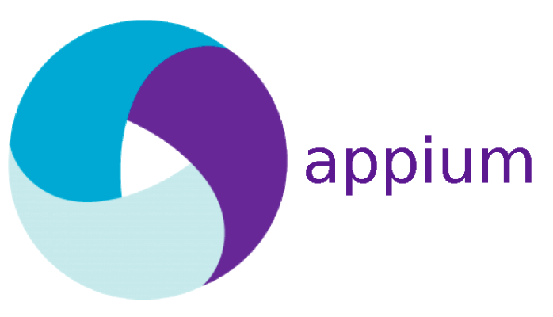

## Hi 👋, I'm a SQA Engineer working in Dhaka, Bangladesh.

#### Now

- ✨ Contributing to [[FastPay](https://www.fast-pay.iq/), [Dalkurd FF](https://dalkurd.se/), [ZiCharge](https://secure.zicharge.com/), [Deshi](https://www.deshipay.com/)]
- :fire: Interested in Automation testing for both web and mobile applications;
- :calendar: Looking for contributing to python - selenium and appium based open source projects.

#### Bio

- 🏢 I'm currently working at **Newroz Technologies Limited**
- ⚙️ I use daily: `.py`, `.jmx`, `.myd`
- 🌍 I'm mostly active within the **SQA Community**
- 🌱 Learning all about **Automation**
- 💬 Ping me about **Selenium**, **Appium**, **Python**, **Postman**, **PostgreSQL**, **Jira**.

#### My Current Stack

      

#### Development Stuffs:

<b>⚡ Github Stats</b>

#### Connect With Me

